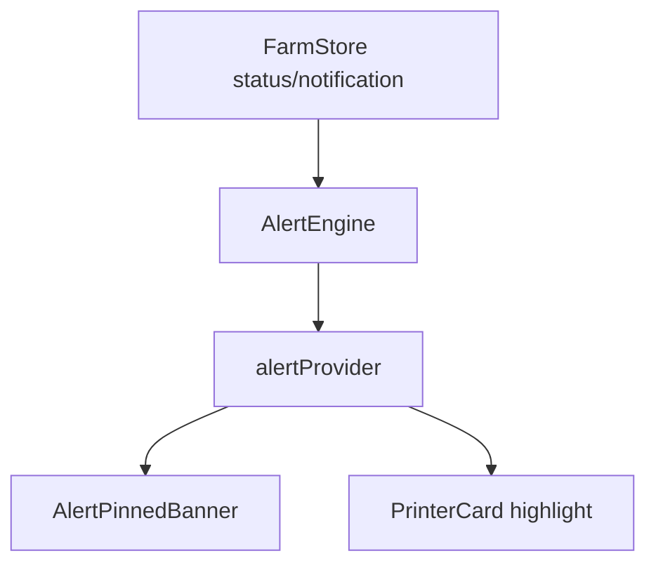

# Design: 异常置顶提示

## 1. 模型

```dart
enum FarmAlertSeverity { critical, warning, info }
enum FarmAlertStatus { active, acknowledged, resolved, muted }

class FarmAlert {
  final String id;
  final String printerSn;
  final FarmAlertSeverity severity;
  final String type;
  final String message;
  final DateTime firstSeenAt;
  final DateTime lastSeenAt;
  final int count;
  final FarmAlertStatus status;
}
```

## 2. 架构



## 3. 告警规则

- 打印错误 / Moonraker error：critical。
- 离线 / 心跳超时：warning。
- HTTP 降级：info 或 warning。
- 温度异常：critical。

## 4. 合并策略

同一设备、同一类型、未解决的告警合并，更新 `lastSeenAt` 和 `count`。
