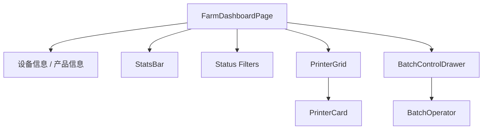

# Design: 全屏控制面板

## 1. 页面结构

## 2. 复用现有组件

- `FarmDashboardPage`：主容器。
- `StatsBar`：统计栏。
- `PrinterGrid`：设备卡片网格。
- `PrinterCard`：设备状态卡片。
- `BatchOperator`：实际命令下发。
- `farmStoreProvider` / `printerListProvider`：状态来源。

## 3. 批量控制抽屉

`BatchControlDrawer` 负责复杂批量操作确认：

- 操作类型：暂停、继续、停止并清盘、设置热床温度、设置喷嘴温度。
- 参数区：温度输入等。
- 已选设备表：序号、型号、设备编号、状态。
- 底部：取消、提交操作。

## 4. 批量操作映射

| UI 操作 | BatchOperator |
| --- | --- |
| 暂停 | `batchPause` |
| 继续 | `batchResume` |
| 停止并清盘 | `batchStopAndClear` 或 `batchCancel` + 清理命令 |
| 设置热床温度 | `batchSetBedTemp` |
| 设置喷嘴温度 | `batchSetNozzleTemp` |

## 5. 性能

- 卡片继续使用 Riverpod `select()` 精确重建。
- 大量设备时避免整页 setState 重建，只更新选择集合和可见卡片。
- 批量结果异步汇总，UI 显示进度和失败原因。
