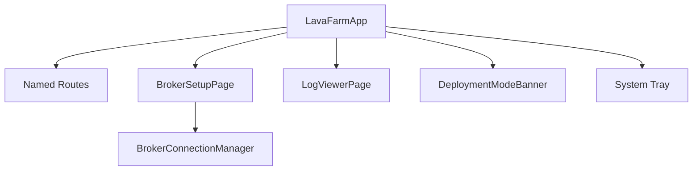

# Design: 桌面控制中心

## 1. 壳层能力

## 2. 现有可复用文件

- `lib/main.dart`
- `broker_setup_page.dart`
- `broker_status_indicator.dart`
- `deployment_mode_banner.dart`
- `log_viewer_page.dart`
- `farm_logger.dart`
- `broker_connection_manager.dart`

## 3. 部署模式

- 生产模式：连接独立 Mosquitto/EMQX Broker。
- 评估模式：允许内嵌或 Docker Broker，但 UI 必须清楚提示限制。

## 4. 诊断

Broker 状态、MQTT 连接、设备状态、批量操作结果均写入本地日志，日志页可查看。
