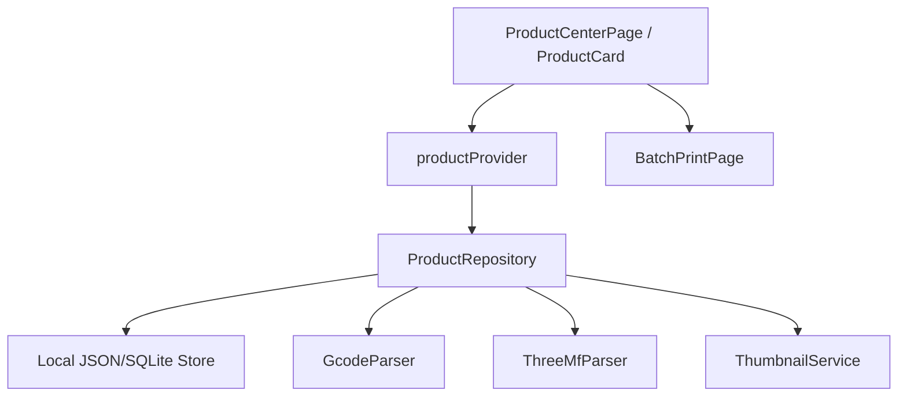

# Design: 产品定义与产品中心

## 1. 数据模型

```dart
class ProductDefinition {
  final String id;
  final String name;
  final int version;
  final String machineModel;
  final Duration estimatedDuration;
  final double totalFilamentGrams;
  final int plateQuantity;
  final List<ProductMaterial> materials;
  final String sourceFilePath;
  final String? thumbnailPath;
  final DateTime createdAt;
  final DateTime updatedAt;
}

class ProductMaterial {
  final String colorName;
  final int argb;
  final double grams;
  final int? extruderIndex;
}
```

## 2. 分层



阶段一优先采用文件/JSON 仓储，接口保持 repository 形态，后续可切换 drift/sqflite。

## 3. UI

产品卡片字段对齐参考图：
- 顶部 3D 缩略图。
- 标题：产品名。
- 信息区：机台型号、生产时长、物料总重、单盘数量。
- 底部：颜色圆点 + 克重 chips。
- 操作：投产、编辑、删除。

## 4. 与现有能力关系

- 复用 `thumbnail_service.dart` 生成/读取缩略图。
- 复用 `thumbnail_image.dart` 展示图片。
- 复用 `file_uploader.dart` 在投产时分发文件。
- `batch_print_page.dart` 接收 `ProductDefinition` 或 productId 作为初始参数。

## 5. 错误处理

- 文件无法解析时允许手工录入关键字段。
- 同名产品导入时自动生成 `version + 1`。
- 缩略图缺失时使用占位图。
